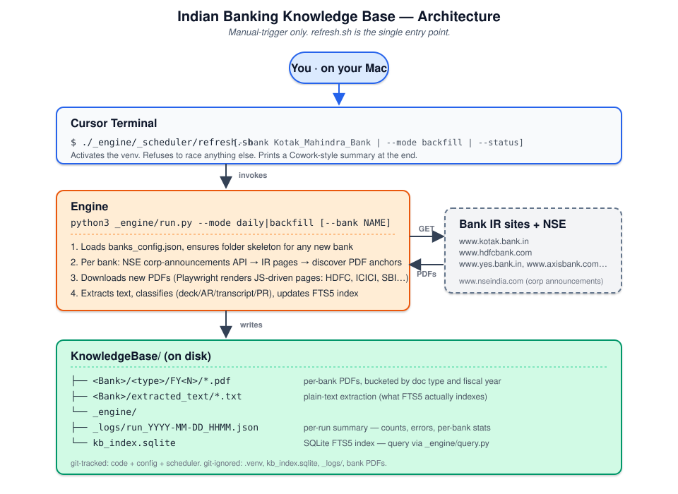

# Indian Banking Knowledge Base Engine

A pipeline that mirrors investor presentations, annual reports, earnings-call
transcripts, and press releases for the top 10 private and top 10 PSU banks in
India, then makes the corpus searchable from the command line — so when you walk
into a CXO meeting at HDFC or SBI, you can ground the conversation in their own
strategic narrative instead of generic AI/banking talking points.

The engine also handles non-bank BFSI customers (NBFCs, insurers, fintechs) —
anything you can configure via `add_bank.py`. The word "bank" in the code is
just the entity label.

---

## Contents

1. [Layout on disk](#layout-on-disk)
2. [First-time setup](#first-time-setup)
3. [End-to-end pilot on one bank](#end-to-end-pilot-on-one-bank)
4. [Backfill (run once)](#backfill-run-once)
5. [Daily refresh — automatic and manual](#daily-refresh--automatic-and-manual)
6. [Searching the corpus](#searching-the-corpus)
7. [Adding a new bank or customer](#adding-a-new-bank-or-customer)
8. [How auto-discovery works](#how-auto-discovery-works)
9. [Command reference (cheat sheet)](#command-reference-cheat-sheet)
10. [Troubleshooting](#troubleshooting)
11. [Files & data hygiene](#files--data-hygiene)

---

## Layout on disk

```
KnowledgeBase/
├── _engine/                 ← code + config + index + scheduler + logs
│   ├── bank_kb/             # Python package
│   │   ├── fetcher.py       # polite HTTP client (retries, throttle, size cap)
│   │   ├── discover.py      # extract <a *.pdf> from any IR page
│   │   ├── classify.py      # label type (deck/AR/transcript/PR) + fiscal period
│   │   ├── extractor.py     # PDF → text + 12 topic flags
│   │   ├── indexer.py       # SQLite FTS5 index + manifest (dedup)
│   │   ├── nse_source.py    # NSE corporate-announcements API client
│   │   ├── js_fetcher.py    # Playwright headless render (optional dep)
│   │   ├── structure.py     # per-bank folder skeleton (single source of truth)
│   │   └── orchestrator.py  # per-bank: discover → download → extract → index
│   ├── _logs/               # JSON run summaries + wrapper/launchd logs
│   ├── architecture.svg     # diagram of the manual-only flow (this README links it)
│   ├── _scheduler/          # the manual refresh.sh + opt-in LaunchAgent + Cowork prompt
│   │   ├── refresh.sh                                  # ← THE entry point. Run from Cursor terminal.
│   │   ├── run_daily.sh                                # wrapper launchd would invoke (LaunchAgent is opt-in)
│   │   ├── com.rahul.banking-kb-daily-refresh.plist.template
│   │   ├── install.sh / uninstall.sh / status.sh       # opt-in LaunchAgent lifecycle (off by default)
│   │   ├── cowork_report_prompt.md                     # report prompt (Cowork task is disabled by default)
│   │   └── README.md
│   ├── banks_config.json    # banks + IR sources + NSE tickers (any N banks)
│   ├── kb_index.sqlite      # FTS5 search index (created on first run)
│   ├── requirements.txt
│   ├── run.py               # backfill/daily orchestrator + --status + --sync-structure
│   ├── add_bank.py          # onboard new banks/customers
│   ├── query.py             # CLI search
│   ├── ALLOWLIST_REQUIRED.txt  # only relevant if you ever run fetch inside Cowork
│   └── README.md            # this file
├── HDFC_Bank/
│   ├── investor_presentations/FY2026/Q2FY26-Earnings-Presentation.pdf
│   ├── annual_reports/FY2025/...
│   ├── transcripts/FY2025/...
│   ├── press_releases/...
│   └── extracted_text/*.txt
├── ICICI_Bank/
│   └── ...
└── ... (18 more banks)
```

---

## First-time setup

Open Terminal and run these once:

```bash
cd "/Users/rahul.choubey/Documents/RWork/Banking_Data/KnowledgeBase/_engine"

# 1. (Recommended) Create a virtualenv so the engine has its own dependency space.
python3 -m venv .venv
source .venv/bin/activate

# 2. Install Python dependencies.
python3 -m pip install -r requirements.txt

# 3. Install Playwright's headless Chromium browser.
#    This is what lets the engine handle JS-rendered IR pages (HDFC, ICICI, SBI)
#    automatically — no manual URL maintenance.
python3 -m playwright install chromium
```

Requires Python 3.10+ on macOS.

If you ever open a new Terminal window, re-activate the virtualenv first:

```bash
cd "/Users/rahul.choubey/Documents/RWork/Banking_Data/KnowledgeBase/_engine"
source .venv/bin/activate
```

---

## End-to-end pilot on one bank

Before committing to a multi-hour 20-bank backfill, run the full pipeline
against one bank to confirm everything works on your machine. Axis Bank is a
good pilot — its IR page is server-rendered (so no Playwright dependency
needed) and it has an NSE ticker (so NSE auto-discovery kicks in too).

### The one-line command

```bash
python3 run.py --mode backfill --bank Axis_Bank --verbose
```

That single command does the complete end-to-end:

1. Warms NSE cookies once.
2. Pulls all Axis Bank corporate filings (investor presentations, annual
   reports, transcripts, financial results) from the NSE announcements API
   for the last 5 years.
3. Fetches the Axis IR landing pages and harvests every `<a *.pdf>` anchor.
4. Merges + dedups both source lists by URL.
5. Downloads each new PDF into `Axis_Bank/<type>/FY<N>/`.
6. Extracts text from each PDF into `Axis_Bank/extracted_text/`.
7. Indexes everything (title + body + topic flags) into `kb_index.sqlite`.
8. Writes a run summary to `_engine/_logs/run_YYYY-MM-DD_HHMM.json`.

### Full pilot sequence (recommended first time)

Copy-paste this whole block in Terminal:

```bash
# 1. Move into the engine directory and activate the virtualenv.
cd "/Users/rahul.choubey/Documents/RWork/Banking_Data/KnowledgeBase/_engine"
source .venv/bin/activate

# 2. (Optional) See starting state.
python3 run.py --status

# 3. Run the full pipeline for Axis Bank only.
python3 run.py --mode backfill --bank Axis_Bank --verbose

# 4. Confirm docs landed and are indexed.
python3 run.py --status

# 5. Sanity-check searchability.
python3 query.py "digital banking OR generative AI" --bank Axis_Bank --limit 5
python3 query.py "" --topic ai_ml --bank Axis_Bank --limit 5

# 6. Run --mode daily to confirm dedup works (should show new_downloads=0).
python3 run.py --mode daily --bank Axis_Bank --verbose
```

### Force a clean fresh pilot

If you've already run Axis Bank and want to wipe everything for a fresh test:

```bash
cd "/Users/rahul.choubey/Documents/RWork/Banking_Data/KnowledgeBase/_engine"
source .venv/bin/activate

# Drop all Axis_Bank rows from the index.
sqlite3 kb_index.sqlite "DELETE FROM manifest WHERE bank = 'Axis_Bank';"
sqlite3 kb_index.sqlite "DELETE FROM documents WHERE bank = 'Axis_Bank';"
sqlite3 kb_index.sqlite "DELETE FROM doc_fts WHERE rowid NOT IN (SELECT id FROM documents);"

# Wipe the downloaded files (Finder confirm-delete may pop up).
rm -rf "../Axis_Bank"/{investor_presentations,annual_reports,transcripts,press_releases,extracted_text}
mkdir -p "../Axis_Bank"/{investor_presentations,annual_reports,transcripts,press_releases,extracted_text}

# Re-run the full pipeline.
python3 run.py --mode backfill --bank Axis_Bank --verbose
```

### What "success" looks like

You should see logs like:

```
INFO bank_kb.orchestrator: [Axis_Bank] starting (backfill mode)
INFO bank_kb.nse_source: NSE: 35 announcements for AXISBANK in last 5 years
INFO bank_kb.orchestrator: [Axis_Bank] fetching IR index https://www.axisbank.com/...
INFO bank_kb.discover: Discovered 18 PDF links on https://www.axisbank.com/...
INFO bank_kb.orchestrator: [Axis_Bank] downloading https://...Q2FY26... -> Axis_Bank/investor_presentations/FY2026/...pdf
...
INFO bank_kb.orchestrator: [Axis_Bank] done: discovered=48 (nse=35 ir=13) in_window=45 new=45 skipped=0 dl_fail=0 ex_fail=0 js_render=0
```

Then `python3 run.py --status` will show ~30–50 Axis_Bank documents indexed
across investor_presentation / annual_report / transcript / financial_result.
A test query like `python3 query.py "digital" --bank Axis_Bank` should return
hits with snippets highlighting the matched terms.

If `new_downloads=0` and `discovered=0`, see the
[Troubleshooting](#troubleshooting) section — usually a network/proxy issue.

---

## Backfill (run once)

Pull 5 years of history for all 20 banks:

```bash
python3 run.py --mode backfill --verbose
```

To pilot on one bank first (recommended — confirms everything is working before
you commit to the full run):

```bash
python3 run.py --mode backfill --bank HDFC_Bank --verbose
python3 run.py --mode backfill --bank Axis_Bank --verbose
```

Expect for the full 20-bank backfill:

- 500–1,500 PDFs (varies by how many press releases each bank lists)
- 1–4 GB of disk
- 1–3 hours wall time on a residential link (the engine sleeps 2 s between
  requests to be polite — adjust `request_delay_seconds` in `banks_config.json`
  if you have a faster pipe)

The engine is **idempotent**. Re-running backfill is safe — already-downloaded
URLs are skipped via the `manifest` table.

---

## Refreshing the KB

The engine runs **only when you trigger it.** No timer, no daemon — both the
macOS LaunchAgent and the Cowork scheduled task are disabled. One script,
one entry point.



```bash
cd /Users/rahul.choubey/Documents/RWork/Banking_Data/KnowledgeBase/_engine/_scheduler

# Bank scope
./refresh.sh                                  # daily, all banks, all types
./refresh.sh --bank Kotak_Mahindra_Bank       # one bank, daily mode
./refresh.sh --mode backfill --bank Yes_Bank  # 5-yr history for one bank

# Document-type scope (pick one or many — folder names you see on disk)
./refresh.sh --type annual_reports            # only ARs, every bank
./refresh.sh --bank HDFC_Bank --type investor_presentations
./refresh.sh --mode backfill --bank ICICI_Bank --type press_releases
./refresh.sh --type annual_reports --type transcripts        # both
./refresh.sh --type annual_reports,transcripts               # same, comma form

# Pin the source URL(s) instead of using banks_config (requires --bank;
# NSE is skipped automatically; banks_config sources for that bank are ignored)
./refresh.sh --bank Kotak_Mahindra_Bank \
    --url https://www.kotak.bank.in/en/investor-relations/financial-results.html
./refresh.sh --mode backfill --bank IDFC_First_Bank --type press_releases \
    --url https://www.idfcfirst.bank.in/our-history/news-media/press-releases
./refresh.sh --bank Yes_Bank --url URL_1 --url URL_2         # multiple URLs
./refresh.sh --bank Yes_Bank --url URL_1,URL_2               # same, comma form

# Utilities (no fetch)
./refresh.sh --status                         # corpus stats
./refresh.sh --sync-structure                 # create folders for any new banks
```

**When to use `--url`** — testing a candidate URL before you commit it to
`banks_config.json`, pulling from a one-off archive page, or pinning to
a single source while you debug discovery on that page. The downloaded
PDFs still land in the bank's normal folders (`<Bank>/<type>/FY<N>/`) and
the classifier still runs — `--url` only changes *where* the engine looks
for PDF anchors. If exactly one `--type` is also passed, it's used as the
`type_hint` for the synthetic source to help the classifier disambiguate
ambiguous URLs.

The four document categories you can filter on:

| `--type` (folder name) | Singular alias | What goes in here |
| --- | --- | --- |
| `investor_presentations` | `investor_presentation`, `presentations` | Quarterly investor decks, analyst presentations |
| `annual_reports`         | `annual_report`, `ar`                    | Standalone + subsidiary annual reports |
| `transcripts`            | `transcript`                             | Earnings-call transcripts (analyst, media) |
| `press_releases`         | `press_release`, `pr`                    | Quarterly result PRs + newsroom announcements |

You can also use `--type financial_results` (singular: `financial_result`) for the slightly-different bucket the classifier uses for results-disclosure PDFs that aren't full investor decks — they're stored alongside investor presentations on disk by design.

What `refresh.sh` does for you that running `python3 run.py` directly doesn't:

1. **Picks the right Python.** Activates `_engine/.venv` automatically — no
   `ModuleNotFoundError: requests` from stray system pythons.
2. **Preflights deps.** Refuses to start if `requests`/`bs4` aren't importable,
   prints the exact `pip install -r requirements.txt` command.
3. **Refuses to race other engine instances.** If something already has a lock
   on `kb_index.sqlite`, it bails out (override with `--force`).
4. **Prints a Cowork-style summary at the end.** Per-bank breakdown of new
   downloads, NSE noise separated from real errors, link to the JSON log.

Set an alias for daily use:

```bash
alias kb='/Users/rahul.choubey/Documents/RWork/Banking_Data/KnowledgeBase/_engine/_scheduler/refresh.sh'
# kb                         # daily, all banks
# kb --bank Kotak_Mahindra_Bank
# kb --status
```

### Re-enabling the daily auto-schedule (if you ever want it back)

Two switches are off by default in this checkout:

- **macOS LaunchAgent** (the unattended 08:30 Mon-Fri run): turn back on
  with `./_engine/_scheduler/install.sh` (custom time via `--time HH:MM`).
  Uninstall with `./_engine/_scheduler/uninstall.sh`.
- **Cowork scheduled task** `banking-kb-daily-refresh`: currently
  `enabled: false`. Toggle it back on from Cowork's Scheduled sidebar
  (or via `mcp__scheduled-tasks__update_scheduled_task` with `enabled: true`).
  The task only reads `_engine/_logs/*.json` — it doesn't run the engine
  itself, so re-enabling it without re-installing the LaunchAgent will
  start producing `STALE` reports whenever you haven't run `refresh.sh`
  recently. That's by design.

The two switches are independent. Re-enable just one if you want chat
reports of your manual runs without an unattended schedule, or just the
other for unattended fetches with no chat reporting.

### Status check

```bash
./_engine/_scheduler/refresh.sh --status
```

Shows last-run time, age of last run, total documents indexed, and the
breakdown by bank and document type. If the last run is older than a few
days, that's the cue to run `./refresh.sh` (without `--status`) to catch up.

### Single-bank refresh

```bash
./_engine/_scheduler/refresh.sh --bank ICICI_Bank
./_engine/_scheduler/refresh.sh --mode backfill --bank Yes_Bank
```

You can still call `python3 _engine/run.py` directly if you prefer — it's
what `refresh.sh` invokes under the hood — but the wrapper handles the
venv activation, dep check, lock collision, and summary printing for you.

---

## Searching the corpus

```bash
cd "/Users/rahul.choubey/Documents/RWork/Banking_Data/KnowledgeBase/_engine"
source .venv/bin/activate

# Top investor-presentation hits across all banks for "generative AI":
python3 query.py "generative AI" --type investor_presentation

# Hyphens, slashes, etc. work — they're auto-quoted as phrases:
python3 query.py "co-lending OR account aggregator"

# HDFC-only, last FY:
python3 query.py "digital banking" --bank HDFC_Bank --fy 2025

# Everything tagged with the digital_banking topic (no keyword needed):
python3 query.py "" --topic digital_banking --limit 50

# Raw FTS5 query (boolean operators, NEAR, column matches, etc.):
python3 query.py "(AI OR genai) AND NOT KYC" --raw

# Corpus stats only:
python3 query.py --stats

# JSON output (best for piping into Claude/an LLM as context):
python3 query.py "core banking modernization" --json > /tmp/ctx.json
```

### Topic flags

Each PDF is auto-tagged with any of these topics that appear in its text. Use
`--topic` to filter:

| Topic | Matches phrases like |
|---|---|
| `ai_ml` | generative AI, LLM, chatbot, ML model |
| `digital_banking` | digital channel, mobile banking, video KYC |
| `channels_integration` | omnichannel, API banking, BaaS, account aggregator |
| `core_banking` | Finacle, FlexCube, T24, core modernization |
| `cloud_infra` | AWS, Azure, GCP, cloud migration |
| `data_analytics` | data lake, customer 360, real-time analytics |
| `cyber_security` | fraud detection, zero trust, infosec |
| `payments` | UPI, CBDC, cards, merchant acquiring |
| `retail_journeys` | customer journey, CX, hyper-personalization |
| `msme_corporate` | MSME, supply chain finance, working capital |
| `wealth` | HNI, AUM, private banking |
| `esg_sustainability` | ESG, green finance, climate |

### CXO-prep workflow

```bash
# Pull HDFC's recent investor-deck text on AI / digital:
python3 query.py "AI OR generative OR digital" --bank HDFC_Bank \
        --type investor_presentation --limit 8 --json > /tmp/hdfc_ctx.json
```

Then paste that JSON into Claude with: *"Here's HDFC's own language on AI and
digital strategy from their last few investor decks. Draft a 3-slide CXO
narrative that maps our tech stack to the priorities they've called out."*

---

## Adding a new bank or customer

`add_bank.py` is one-shot. It creates the folder structure, updates
`banks_config.json`, **and immediately runs the full 5-year backfill** —
NSE corporate-announcements + IR-page scrape + Playwright (if needed) →
download → extract → index. So a single command both onboards the customer
and downloads all their historical data.

Pass `--no-backfill` if you want to register the config without fetching yet.

**Once the bank is in `banks_config.json`, every other piece of the system
picks it up automatically:**

- The daily LaunchAgent fetches it on the next 08:30 run.
- The Cowork report includes it in the per-bank breakdown without any
  prompt changes — the report iterates over `banks[]` in the JSON log,
  not a hardcoded list.
- `run.py` calls `ensure_all_banks_structure()` at startup, so the per-bank
  folders are created on the next run even if `add_bank.py` wasn't used.

That last point is the safety net for the "I just hand-edited
`banks_config.json` to fix a URL and added a new bank while I was in
there" workflow. If you want folders created immediately without waiting
for tomorrow's daily run, use:

```bash
python3 run.py --sync-structure       # idempotent, no fetching, ~instant
```

The list of per-bank subfolders (`investor_presentations`, `annual_reports`,
`transcripts`, `press_releases`, `extracted_text`) lives in
`bank_kb/structure.py` as `SUBFOLDERS` — change it there once and both
`add_bank.py` and `run.py` start creating the new layout for every bank.

### Add a new NSE-listed bank (and pull 5 years of data)

```bash
python3 add_bank.py --name South_Indian_Bank --ticker SOUTHBANK --category private \
    --source "https://www.southindianbank.com/investor-relations" mixed \
    --source "https://www.southindianbank.com/financial-results" investor_presentation
```

What happens after you press Enter:

1. `South_Indian_Bank/{investor_presentations,annual_reports,transcripts,press_releases,extracted_text}/` folders created.
2. Entry added to `banks_config.json`.
3. NSE warmed and queried for `SOUTHBANK` filings (last 5 years).
4. Both IR pages fetched and PDF anchors harvested.
5. Every new PDF downloaded to the right `FY<N>/` subfolder, extracted, and indexed.
6. Run summary saved to `_engine/_logs/run_YYYY-MM-DD_HHMM_addbank_South_Indian_Bank.json`.
7. Summary printed: `discovered=N (nse=N, ir=N), downloaded=N, failures=...`.

### Add a non-bank customer (NBFC, insurance, fintech)

```bash
python3 add_bank.py --name Bajaj_Finance --category nbfc \
    --source "https://www.bajajfinserv.in/investor-relations" mixed
```

No NSE ticker means the engine relies on IR-page scraping alone — perfectly
fine for unlisted entities or non-bank customers. Folder structure is created
and the backfill runs immediately, same as above.

### Add a customer with a JS-rendered IR page

```bash
python3 add_bank.py --name HDFC_Life --ticker HDFCLIFE --category insurance \
    --source "https://www.hdfclife.com/investor-relations/financials" mixed \
    --requires-js
```

`--requires-js` tells the engine to render this source in headless Chromium
via Playwright before scraping links — needed for client-rendered IR pages.

### Register without fetching (rare)

```bash
python3 add_bank.py --name X_Bank --ticker XBANK --category private \
    --source "https://www.x.com/ir" mixed --no-backfill
```

When you're ready to fetch later:

```bash
python3 run.py --mode backfill --bank X_Bank --verbose
```

### Merge new sources into an existing entry

Re-running `add_bank.py` with the same `--name` merges new sources into the
existing entry without duplicating URLs. The backfill that follows is
idempotent — only new (unseen) URLs get downloaded. Use `--replace` if you
want to wipe the existing entry and start over.

### Update only the ticker for an existing entity

```bash
python3 add_bank.py --name South_Indian_Bank --ticker SIB \
    --source "https://example.com/dummy" mixed --no-backfill
```

`--source` is required (every entry needs at least one path). Edit
`banks_config.json` directly if you want to clean up unwanted sources.

---

## How auto-discovery works

For each bank, every run hits **three** discovery sources and merges results:

1. **NSE corporate-announcements API** — the primary, hands-off source. Every
   NSE-listed bank in scope is required by SEBI to file investor
   presentations, annual reports, earnings transcripts, and financial results
   on NSE. The engine warms up NSE cookies once per run, then asks the API for
   each ticker's filings over the last `history_years` window. NSE returns
   the authoritative filing date for every PDF, which the engine uses to
   filter by the history window even when filenames have no date in them.

2. **Bank IR page HTML scraping** — for each `source` URL in
   `banks_config.json`, the engine fetches the page and harvests every
   `<a href="*.pdf">` anchor. This catches the press releases, special updates,
   and additional decks that banks publish on their own site but don't file
   formally with NSE.

3. **Playwright headless render (auto-fallback)** — when a `source` is marked
   `requires_js: true` (HDFC, ICICI, SBI), or when raw-HTML scraping returns
   zero links, the engine re-renders the page in headless Chromium and parses
   the resolved HTML. Handles every client-rendered IR page automatically.

All three sources flow into the same dedup-by-URL stream, so there's no
double-download even when a doc appears on multiple sources. The `manifest`
table makes re-runs idempotent.

There's still a `seed_urls` escape hatch in `banks_config.json` for unusual
one-off cases (an old historical PDF you want to backfill from a specific URL),
but you never need to touch it for routine new-quarter ingestion.

---

## Command reference (cheat sheet)

All commands assume you're inside the engine directory with the virtualenv
activated:

```bash
cd "/Users/rahul.choubey/Documents/RWork/Banking_Data/KnowledgeBase/_engine"
source .venv/bin/activate
```

| What you want | Command |
|---|---|
| **End-to-end pilot on one bank** | `python3 run.py --mode backfill --bank Axis_Bank --verbose` |
| Initial 5-year backfill, all banks | `python3 run.py --mode backfill --verbose` |
| Backfill a single bank | `python3 run.py --mode backfill --bank HDFC_Bank --verbose` |
| Daily refresh, all banks | `python3 run.py --mode daily --verbose` |
| Daily refresh, single bank | `python3 run.py --mode daily --bank ICICI_Bank --verbose` |
| Manual catch-up after a missed schedule | same as daily refresh above |
| See last-run state + corpus size | `python3 run.py --status` |
| Add a new bank (NSE-listed, auto-backfills 5y) | `python3 add_bank.py --name X --ticker XYZ --category private --source URL mixed` |
| Add a customer (unlisted, auto-backfills 5y) | `python3 add_bank.py --name X --category nbfc --source URL mixed` |
| Add a customer, register only (no fetch yet) | `python3 add_bank.py --name X --ticker XYZ --category private --source URL mixed --no-backfill` |
| Search the corpus | `python3 query.py "your terms"` |
| Search with filters | `python3 query.py "AI" --bank HDFC_Bank --type investor_presentation --fy 2025` |
| Filter by topic only | `python3 query.py "" --topic digital_banking --limit 50` |
| Get JSON for piping to an LLM | `python3 query.py "..." --json` |
| Corpus stats | `python3 query.py --stats` |
| List scheduled tasks | (open Cowork → "Scheduled" sidebar) |

---

## Troubleshooting

### "No module named bank_kb" or similar import errors
Make sure you're running from the `_engine/` directory and the virtualenv is
activated:
```bash
cd "/Users/rahul.choubey/Documents/RWork/Banking_Data/KnowledgeBase/_engine"
source .venv/bin/activate
```

### Playwright errors / no JS-render happening
Confirm Playwright is installed and its Chromium is downloaded:
```bash
python3 -m pip show playwright
python3 -m playwright install chromium
```
The engine logs `Playwright unavailable: ...` if it can't import — Playwright
is optional; the engine still uses NSE for the rest.

### A specific bank shows `discovered_via_nse=0` in the run log
Either:
- The ticker symbol in `banks_config.json` is wrong → fix it and re-run.
- NSE rate-limited or blocked the warmup → just re-run a few minutes later.
- The bank isn't NSE-listed → that's expected, IR scraping still runs.

### A specific bank shows `discovered_via_ir=0` in the run log
- Open the source URL in a browser. If it requires login or is gated, scraping
  won't work — remove the source and rely on NSE.
- If the page renders fine in a browser but the engine sees nothing, add
  `"requires_js": true` to that source in `banks_config.json` and re-run.

### Last run was days ago — what should I do?
```bash
python3 run.py --status
python3 run.py --mode daily --verbose   # manual catch-up
```

### Search returns nothing for a term you know exists in a downloaded PDF
- Confirm the PDF was indexed:
  ```bash
  python3 query.py --stats
  ```
- Inspect the extracted text directly:
  ```bash
  grep -l "your phrase" /Users/rahul.choubey/Documents/RWork/Banking_Data/KnowledgeBase/*/extracted_text/*.txt
  ```
- If the term is hyphenated or has unusual chars, the auto-quoter handles
  that, but you can also pass `--raw` for explicit FTS5 syntax.

### Force a fresh rebuild for one bank
```bash
# Remove the per-bank manifest entries:
sqlite3 kb_index.sqlite "DELETE FROM manifest WHERE bank = 'HDFC_Bank';"
sqlite3 kb_index.sqlite "DELETE FROM documents WHERE bank = 'HDFC_Bank';"
sqlite3 kb_index.sqlite "DELETE FROM doc_fts WHERE rowid NOT IN (SELECT id FROM documents);"
# Then re-backfill:
python3 run.py --mode backfill --bank HDFC_Bank --verbose
```

### Find run logs
```bash
ls -lt "/Users/rahul.choubey/Documents/RWork/Banking_Data/KnowledgeBase/_engine/_logs/" | head
```
Each `run_YYYY-MM-DD_HHMM.json` has per-bank counts, errors, and the index
totals at end-of-run. `wrapper_YYYY-MM-DD_HHMM.log` files in the same folder
are the LaunchAgent's stdout/stderr capture — useful when the engine didn't
even start (e.g. wrong Python path) and so no JSON log was written.

---

## Files & data hygiene

- The engine never modifies bank servers (read-only HTTP GETs).
- Every downloaded URL is recorded in `manifest` so re-runs are idempotent.
- Run summaries land in `_engine/_logs/run_YYYY-MM-DD_HHMM.json` for audit/debugging.
- Delete `kb_index.sqlite` and any bank folder if you want to force a fresh
  rebuild for that bank.
- The 5-year history window is configurable in `banks_config.json`
  (`settings.history_years`).
- The default `request_delay_seconds` is 2 — increase if banks rate-limit
  you, decrease if you're on a fast pipe and want a faster run.
